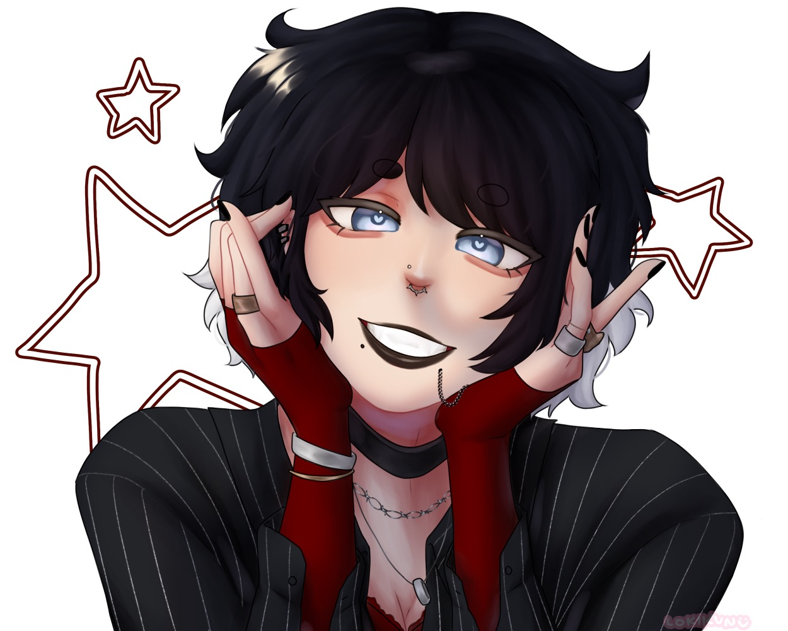

WIP

## Hanako Taeko

Nicknames/Alias: Bloody Mary  
Age: 22ish – exact age unknown  
Birthday: ??  
Height: 5’9  
Gender: Female  
Sexuality: ??  
Species/Race: Human  

Affiliation(s):  
Hamori  

Occupation(s):  
Hamori Executive  

Relatives: 
Himiko Taeko - Twin sister, deceased 
Older brother - deceased 
Parents- deceased 

Relationships: 
Nagori - A kid Hanako found on a job. She took her in as an apprentice, but isn't the ideal parent... 
Gaki - Interested in his story, finds it amusing to tease him. The two of them parallel each other, which is why Gaki hates her so much; Gaki isn’t fully human but feels everything, and Hanako is one who feels nothing. 

Lore: Hanako is currently one of the strongest executives in Hamori, on par with Gaki. She is feared due to this, because she is an ordinary human being. She is often sent on intel gathering or assassin missions, due to her ability to analyze and manipulate. 

Personality: Since birth, Hanako has been unable to feel emotions. She always has a smile on her face, and will even be silly at times, but it’s all an act. She is evil, psychotic, and a sociopath. She’s incredibly manipulative, but people can't help but be drawn to her. She is like this both because of her upbringing, and because of the violent environment she had been in her whole life. Since she can't judge things emotionally, she studies human behavior to "replicate" being a human.

Backstory: Hanako was born into Hamori. Her parents were valued executives of Hamori, however, they kept the details from their kids. Growing up, Hanako quickly realized she was different. She saw other kids express constant high emotions, and thought it was strange. She also noticed other adults grow concerned about her, so she quickly learned how to act like everyone else around her. She pretended to feel joy, sadness, frustration, etc., but the truth was she felt nothing. Not until a certain incident. Before this, since her parents are from Hamori, they’ve always taught her to deal with things through violence. They told her to be the strongest, and to take advantage of other people’s emotions. They basically taught her to take what she wants, with whatever means necessary. Her parents didn’t necessarily raise her and her siblings with love, but with logic. They were emotionally neglectful. The closest person she had to her was her twin sister, Himiko. Himiko was the only person who truly showed Hanako affection, another thing she didn’t understand. Hanako mirrored Himiko’s behaviors, giving Himiko affection back. Back to that incident, in her school days she found an interest in some person in her class. Obviously, not a romantic interest, but she studied them because they were different. Her classmates didn't know this of course, so girls didn’t like that she paid attention to this person, which ended up in them confronting her about it with a heated argument and attempts to bully her. But… remember what Hanako’s parents taught her. This broke out into a fight, where Hanako firsthand felt violence for the first time. What she felt during this was… ecstasy. The person she fought ended up having severe injuries, and of course, Hanako got suspended. But this was the first time Hanako actually felt anything in her life. From then, she would occassionaly experiment, but it wasn’t the same. 
At some point, Hanako’s home gets set on fire, killing everyone except her brother who was MIA. Himiko sacrificed herself to save Hanako… It was believed that this happened because of the many enemies Hanako’s parents made, until Hanako reunited with her older brother.

Powers/Abilities: None. She is completely and 100% a regular human being, which makes her all the more terrifying.

Character Inspirations: Douma (Demon Slayer), Junko Enoshima (Danganronpa)  
Voice Claim: Chloe D’Apchier Japanese Voice  
Currently Listening To: Echo Remix - The Living Tombstone  

## Gallery

    
        
        
            
            
            
    
            <a href="{{ file.path }}" title="{{ filename }}">
                
                {{ filename }}
            </a>
            
        
    

