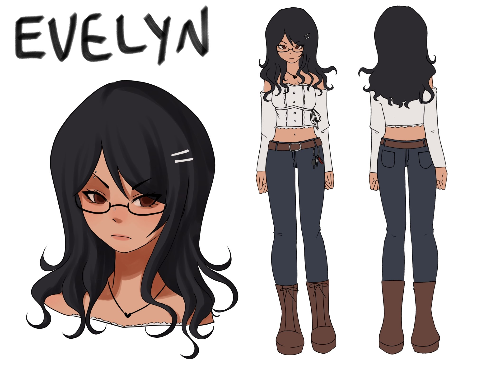

This has spoilers to my game No Place to Lie! It is recommended to play the game first and then continue on!

⋆𐙚₊˚⊹♡

⋆𐙚₊˚⊹♡

Nicknames/Alias: Eves, Evie, Lyn 
Age: 24 
Gender: Female 
Sexuality: Lesbian 

Occupation(s): 
Detective 

Relatives: 
Evelyn moved away from her parents with no contact after breaking up with Bonnie. She doesn’t have any other relatives. 

Relationships: 
Bonnie Montclair - Lover. Evelyn feels like Bonnie doesn’t trust her enough to be herself. She gets angry at Bonnie for always smiling when things aren’t okay, even when they broke up. Sometimes during their relationship, Bonnie’s mask would crack, showing a more possessive side, but in the end she’d always cover it up with some excuse or go back to being her “usual” self. 
Brooks Montclair - Bonnie's older sibling. They seem to have one sided resentment for Evelyn. 

Lore: After Bonnie died, she was depressed and lost. After talking with Bonnie’s parents and spending a short amount of time with them after the accident, she realized she never really knew Bonnie at all. The way Bonnie’s parents saw her was completely different from Evelyn’s perception, setting her off and questioning her self-worth, due to Bonnie not showing her true self or anything about her condition or past despite their years of dating.  
During the investigation, after reviewing the hit and run case and realizing who the victim was, Evelyn desperately tries to make a connection between this murder and Bonnie’s death. Evelyn has a hard time accepting Bonnie’s death, especially since she never knew of Bonnie’s condition. Evelyn tries anything to create a new culprit, to have someone else to blame.

Personality: Evelyn is a reserved, stern, and closed off individual, however she has a determined and sensitive side. Because she gets easily hurt, she closes people off to avoid the outcome. Especially after Bonnie’s death, she fears getting closer to people that may reopen old wounds.

Backstory: Evelyn had a neglectful family life. She was always the quiet kid, until she met Bonnie in high school. They were high school sweethearts for a while, until Evelyn got fed up with how much information about her life Bonnie hid from her.

Currently Listening To: Sienna - The Marias

## Gallery

    
        
        
            
            
            
    
            <a href="{{ file.path }}" title="{{ filename }}">
                
                {{ filename }}
            </a>
            
        
    

