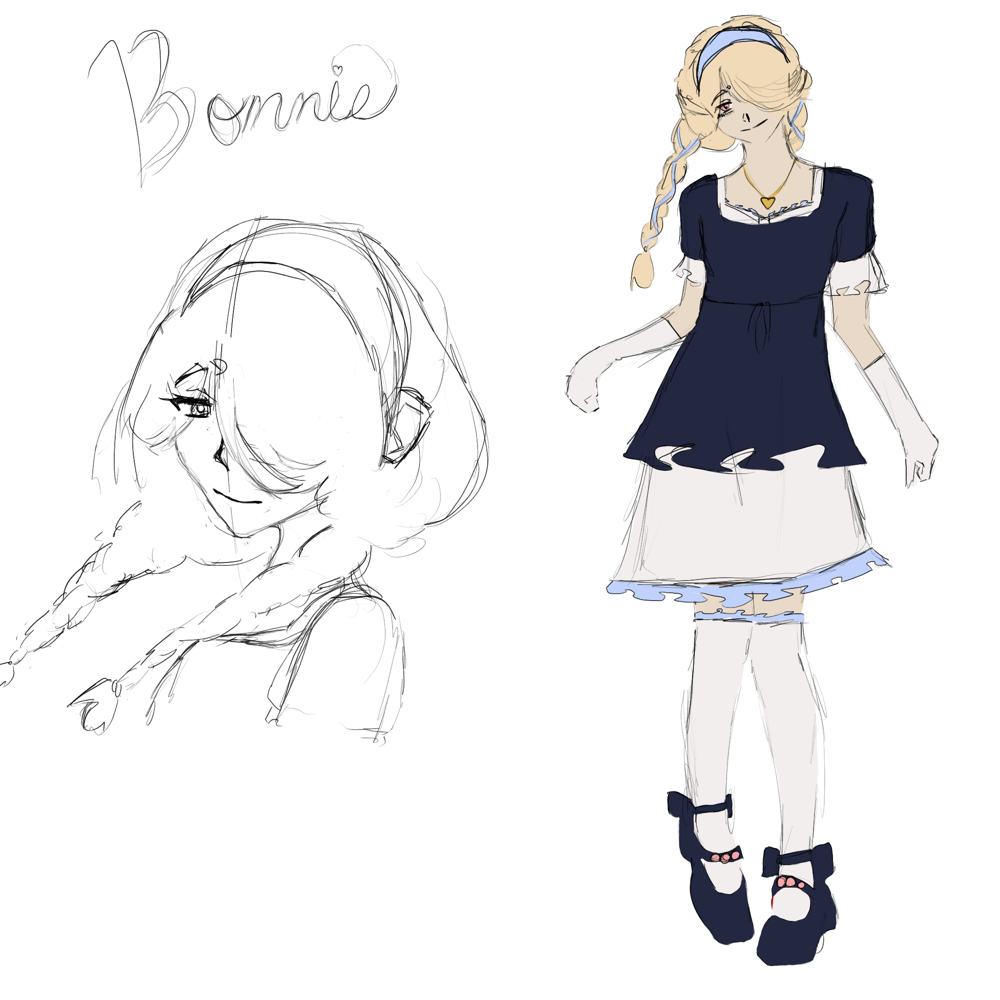

This has spoilers to my game No Place to Lie! It is recommended to play the game first and then continue on!

⋆𐙚₊˚⊹♡

⋆𐙚₊˚⊹♡

Nicknames/Alias: N/A 
Age: 23 
Gender: Female 
Sexuality: Lesbian 

Occupation(s): 
Assistant Investigator 

Relatives: 
Mother - a soft spoken but kind woman. She’s very paranoid about Bonnie’s health 
Father - the kind of guy that calls bonnie kiddo. Became closed off and silent when Bonnie died 

Relationships: 
Evelyn - High school sweethearts. Bonnie was too afraid to open up to Evelyn. If she did, and Evelyn treated her just like everyone else did, it would be too much for her to bear. So, the closer they got, the more Bonnie hid.  

Lore: Bonnie got into a car accident. She had an attack from her health (coughing fit, heart problem, etc) that distracted her from the wheel causing the accident with her death and the other person still living.

Personality: She is always seen as someone who is bright and smiling. However, she has a clear wall that doesn't allow her to let anyone into her life, not even her girlfriend. She doesn't let her true self shine because she’s afraid of rejection, and hides her ‘ugly’ emotions – she wants to be flawless. She's a strong willed and stubborn girl who doesn’t like admitting weakness because of how she’s been treated as fragile her whole life.

Backstory: She’s always been sick her whole life. Because of this, her parents were extra doting and caring towards her. To Bonnie’s dismay, they treated her like she could break at any moment, so she hid her weaknesses to avoid similar treatment from others. Some time in elementary school, her condition wasn’t hidden - it was out in the open. Because of this, the adults around her would act like her parents, and the kids would generally stay away from her so as not to be held responsible if something did happen.

Character Inspirations: Mari (Omori) 
Currently Listening To: Back to Me - The Marias 

## Gallery

    
        
        
            
            
            
    
            <a href="{{ file.path }}" title="{{ filename }}">
                
                {{ filename }}
            </a>
            
        
    

