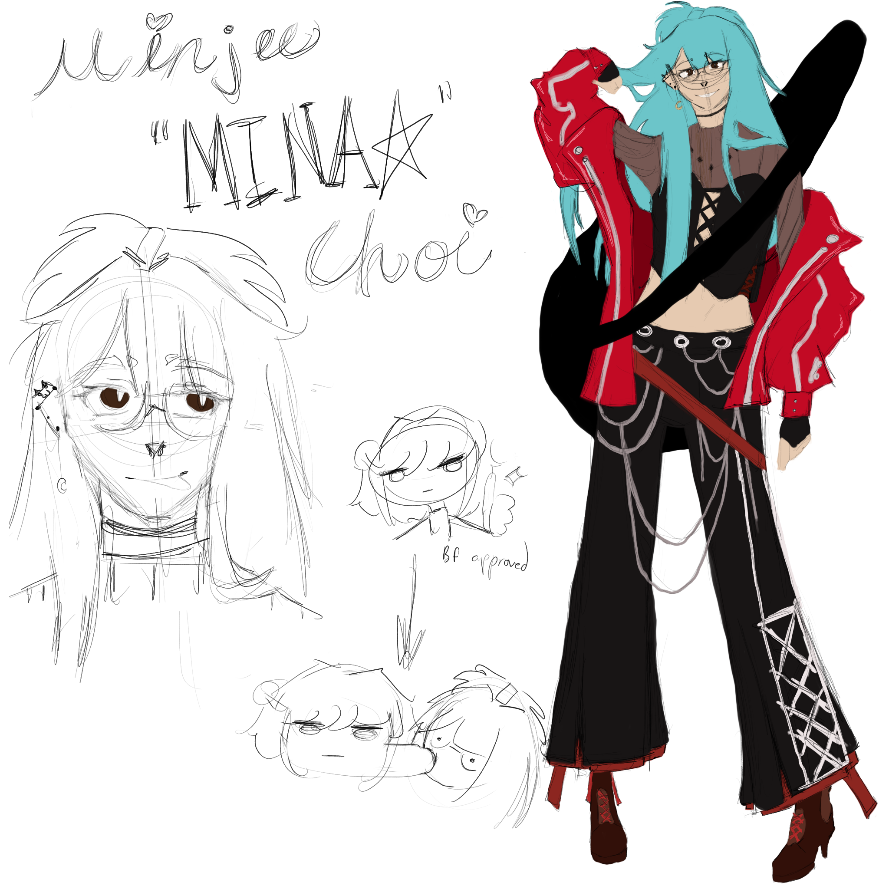

## ☆Minjee Choi☆ 

Nicknames/Alias: MINA𖤐 
Age: 22 
Birthday: May 16th 
Height: 5’7 
Gender: Female 
Sexuality: Bi 
Species/Race: Human 

Affiliation(s): 
Nanasaki  
USANG Entertainment 

Occupation(s): 
Celebrity/Idol 

Relatives: 
Father - deceased 
Mother - complicated 

Relationships: 
Jin Kang - Lover 
Sua Kang - Best friend 
Band members - Sora Kazuya, Ayako Saito, Nagisa Hanamine, Sua Kang 
Yuichiro Saotome - Close friend with a sibling like relationship 

Lore: As she’s built her reputation and become the #1 sensation across the world, she got invited to join a competition show with other famous celebrities from around the world. This show… turns out to be a death game that she can’t escape. When she arrives, something resembling a system window pops up in front of everyone in the world, announcing the death games, with this show being one of them. The only way to live is to outshine the others, so she performs to save her own life. Throughout the games, she gets less and less in touch with her humanity, losing her sanity from all the deaths she sees while also trying to keep it together and perform as the perfect angel everyone makes her out to be.

Personality: She acts like a very bubbly person and puts on a show for everyone, like an ‘angel.’ But she’s also very cunning, and knows how to get her way in the entertainment industry. She was a top student in her high school days. 

Backstory: Her father died when she was very young in an accident, and her mother, filled with grief, moved them to Japan. When her dad died, Mina wasn’t very kind to her mother. This causes a very strained relationship, as her mother doesn’t even look at her, much less acknowledge her as her daughter anymore. Once she graduates High School, she reunites with her childhood friend, Sua Kang, and her brother, Jin Kang. Minjee's passion for music becomes a reality as she creates a band with Sua and some old friends from her high school, and from there, she is known as a young talent with potential, and grows into the star she is today.

Powers/Abilities: Her "ability" is that she can trick people into loving her through her performances and the way she meticulously presents herself at every moment.

Character Inspirations: Ai Hoshino (Oshi no Ko) 
Voice Claim: Sumetal (lead vocalist) from Babymetal 
Currently Listening To: Megitsune - Babymetal 

⋆𐙚₊˚⊹♡

⋆𐙚₊˚⊹♡

## Gallery

    
        
        
            
            
            
    
            <a href="{{ file.path }}" title="{{ filename }}">
                
                {{ filename }}
            </a>
            
        
    

