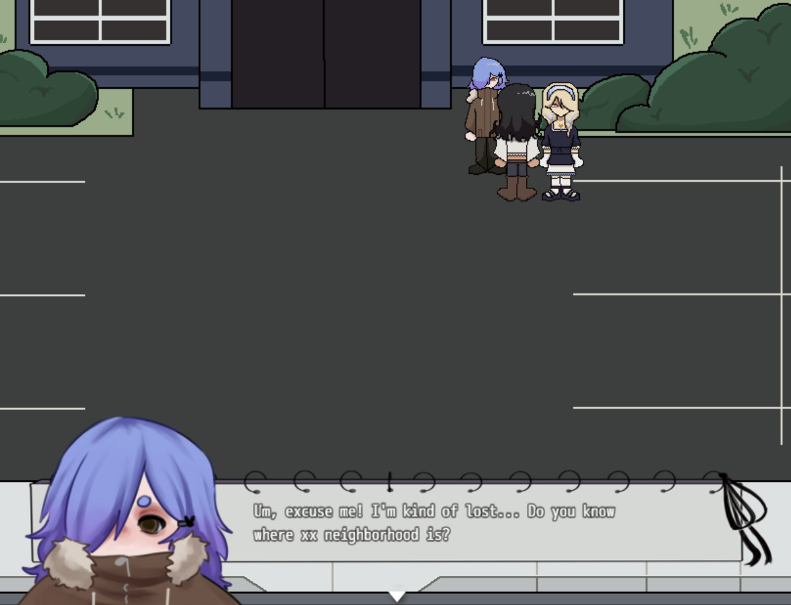
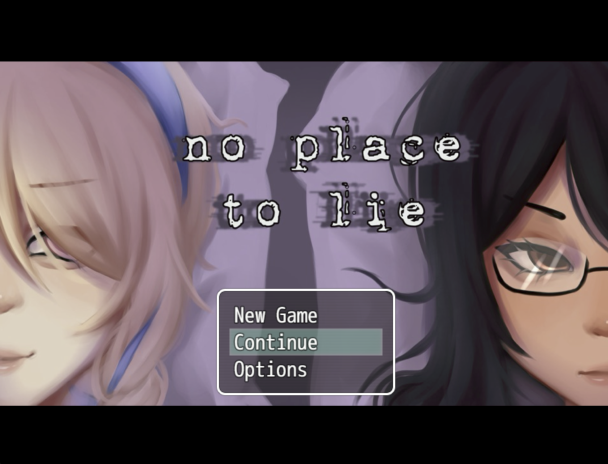
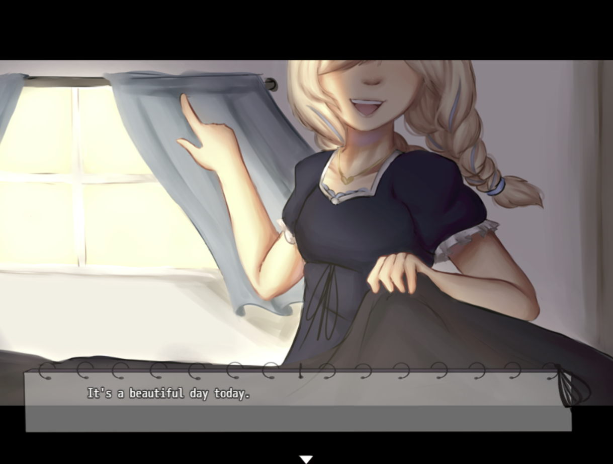

# No Place To Lie

⋆𐙚₊˚⊹♡

⋆𐙚₊˚⊹♡

## Overview

Detective Evelyn and her assitant Bonnie are assigned a new case after Evelyn's 2 week absence. They must push past the difficulties in solving it due to its great resemblance towards Evelyn's painful history and solve both the case at hand and the case from the past once and for all.

## Gameplay

Arrow Keys to move, Z to interact, X to cancel. There are 4 endings based on the player's choices throughout the game. Features include 27 original CGs, and 8 maps throughout the game that the player can explore.

## My Role

I was a Lead Designer. I worked in a team of 3 to create a playable visual novel utilizing RPGMaker MV. I collaborated with my team members to create the narration, character designs, and concept art. On my own, I compiled all game assets, story, and soundtrack for final implementation, as well as created all pixel art assets in game using ReSprite. 

CGs by

⊹ ࣪⋅˚₊‧ ୨୧ ‧₊˚ ⋅

