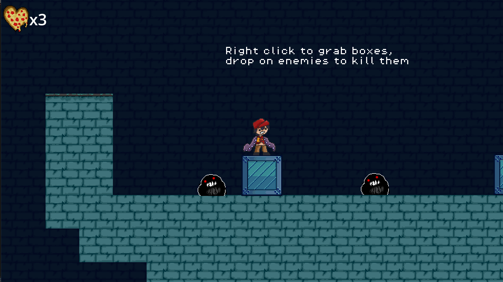
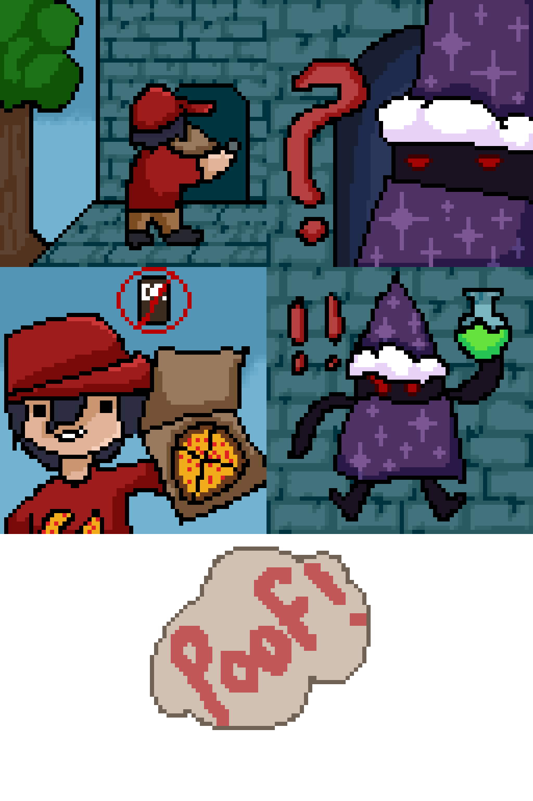

# Delivery Dan & The Wizard Man

𐂐◯𓇋
𐂐◯𓇋

## Overview

The customer is a wizard who becomes enraged because delivery Dan forgot the wizard's drink! In an angered fit, the wizard turns Dan's arms into tentacles! Now Dan must go through the wizard's wacky tower and defeat the freaky foes residing in it to regain his arms.

## Gameplay

The player uses WASD to move and space to jump. The player can right click to grab boxes with their tentacle arm, and click again to drop on top of enemies. The player can also left click to grapple on to surfaces and swing across. The player must avoid enemies or kill them and try not to fall to their death. They get 3 lives until it's game over.

## My Role

For this project, I was the sole artist. I spent ~6-8 hours a day for a week getting in all the assets. This project really taught me what it means to have a strict deadline and not too much time. If I had more time, I wish I could've made more detailed tiles and backgrounds. Even so, I was very proud of the pixel art I created and what I was able to complete with such little time.

‧₊˚ â‹…  ğ“𓩠‧₊˚ â‹…

