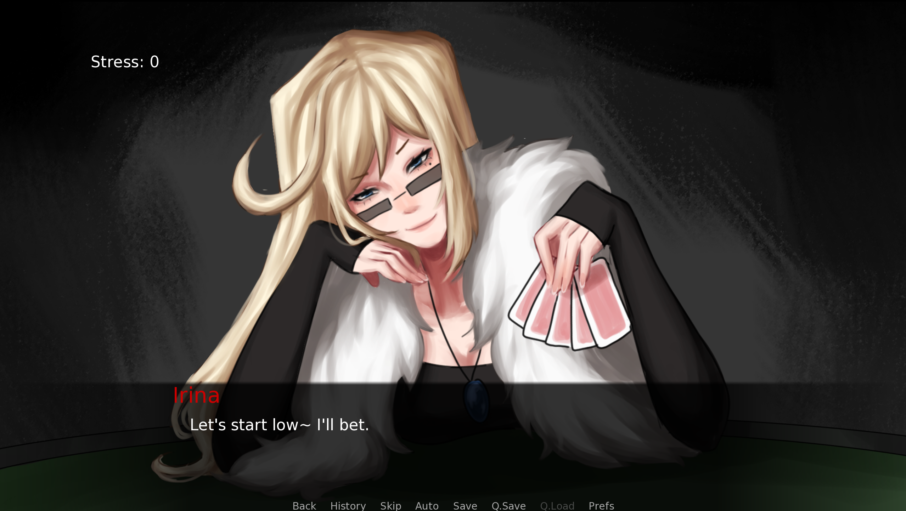
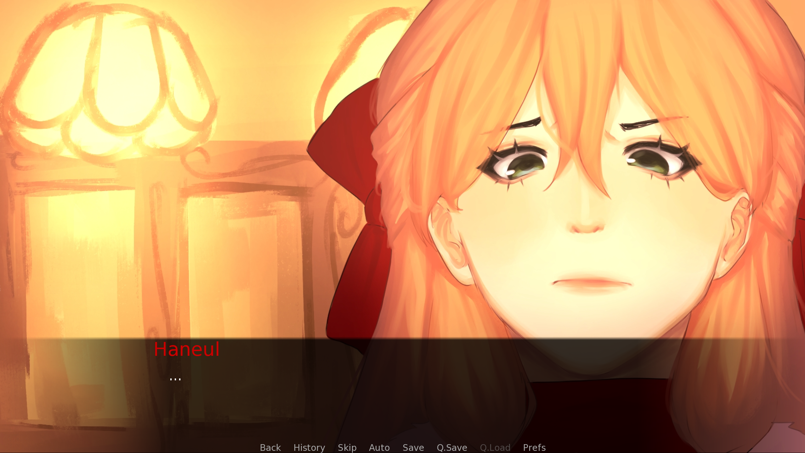

# Poker Face

♤ ♡
♧ ♢

## Overview

Poker Face is a short choice-based visual novel, where a girl, Haneul Lee, stumbles into a casino known for its high society culture, and meets the beloved model, Irina Engel. By using each other for their own gain, they start to develop a relationship through risk and loss.

Gameplay screenshot.

## My Role

Wrote a demo story and learned renpy within a week's timeframe with one teammate for a game jam. Used renpy to compile all assets and dialogue. Teammate, lokikvn, created art assets. 

Introduction Cutscene screenshot.

˗ˋˏ⛀⛁🃜 🃚 🃖 🃁 🂭 🂺⛁⛀ˎˊ˗

