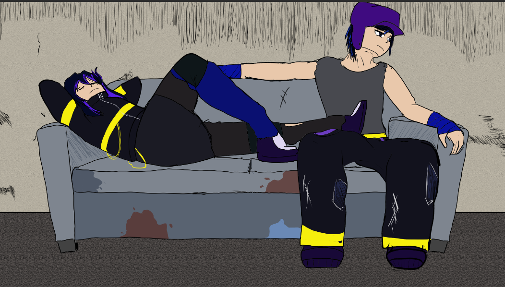
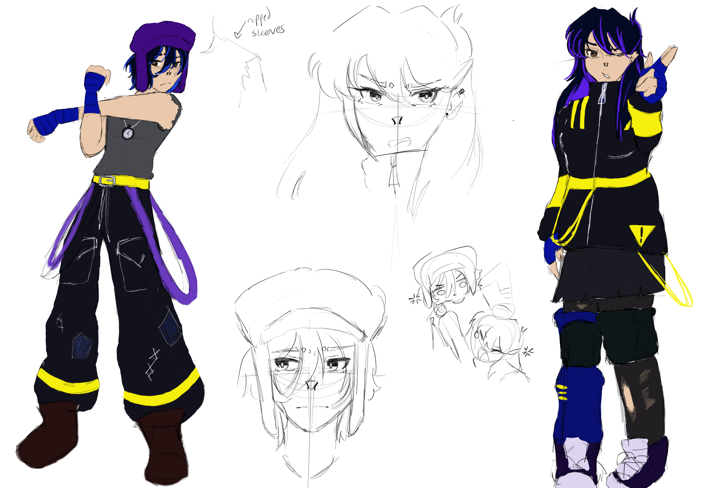
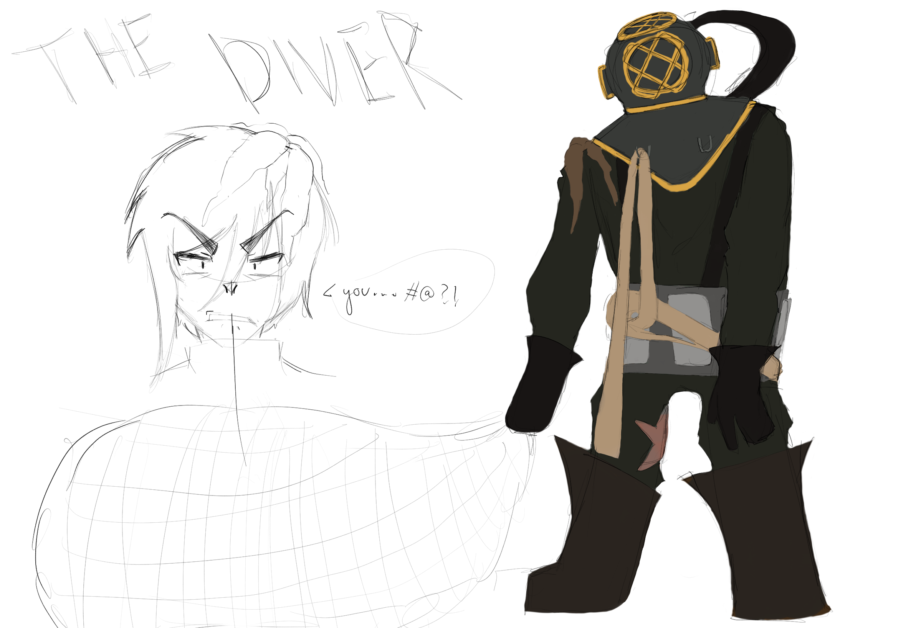

# Twinball

This Game is a work in progress.

## Overview

Tired of their lives in the wastes, the story follows the "pinball twins" as they search for treasure so they can live in luxury. They are given a map by some odd scientist and are determined to live comfortably for the rest of their lives. Unfortunately, it appears a lot of other people have the same idea...

## Gameplay

Dynamic Pinball Inspired Boss Rush. Use the shift buttons to flip the left and right bumpers, and Z and / to dash.

art piece by a lead programmer and designer, Willow Frank.

## My Role

I am the art lead in this project as well as available to help with programming when needed. Once I joined the team, I created concept art for the main characters as shown below, as well as for the boss for the current level we wish to present as a demo. After that, I've been creating assets for the level and helping flesh out the story and world building in more details.

𝕏
𝕏

⛧°。 ⋆༺♱༻⋆。 °⛧

