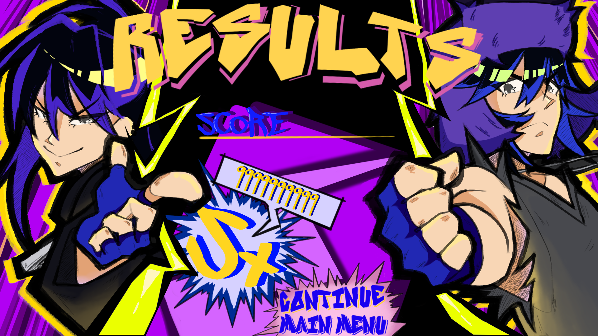
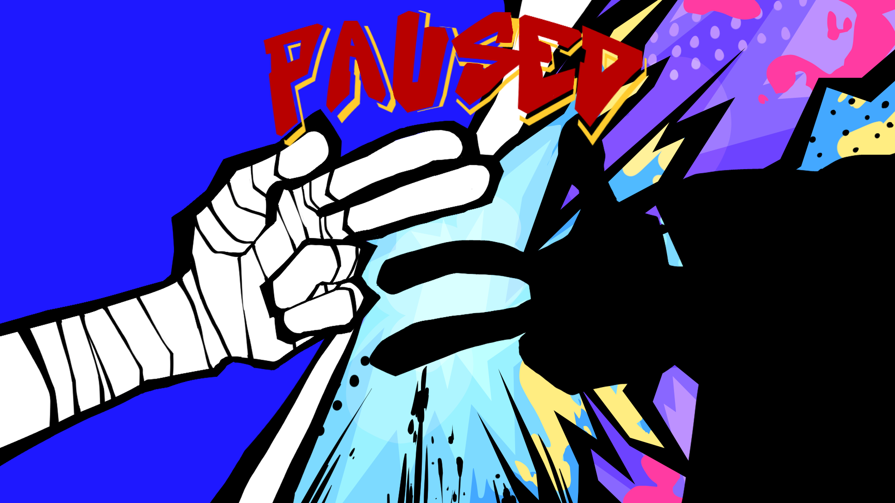
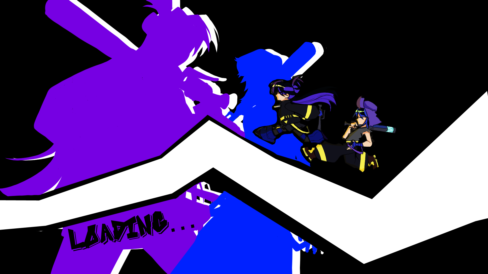

# Twinball

This Game is a work in progress, funded by the Magic Maker Program at RIT

ִ ࣪𖤐
ִ ࣪𖤐

## Overview

Tired of their lives in the wastes, the story follows the "pinball twins" as they search for treasure so they can live in luxury. They are given a map by some odd scientist and are determined to live comfortably for the rest of their lives. Unfortunately, it appears a lot of other people have the same idea...

## Gameplay

Dynamic Pinball Inspired Boss Rush. Use the obstacles in the level to your advantage to damage the boss. These include bumpers and a variety of balls, such as a ball that splits in two, a bounce ball, and a damage ball.

## My Role

I was the art lead in this project. Once I joined the team, I created concept art for the main characters as shown below, as well as for the boss for the current level we wish to present as a demo. After that, I've been creating assets for the level and helping flesh out the story and world building in more details.

During the summer of 2025, I worked on making the art style more unique and flashy. I want the visuals to really stand out and grow sharper. As the Art Lead, I will be making sure everything is consistent as well as eye catching. I started to add coloring to my focus, and would color the screens and character art to really make them pop. We were able to finish one level, a tutorial, and several other menus. Examples of rough concepts are shown below.

𝕏
𝕏

⛧°。 ⋆༺♱༻⋆。 °⛧

