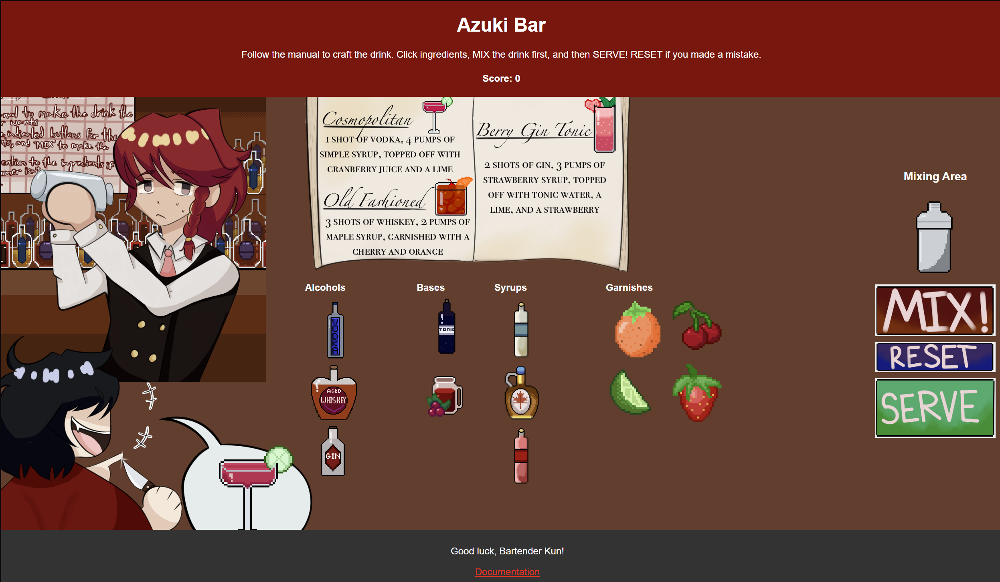

# Azuki Bar

✧˖ °
⋆｡°✩

## Overview

You’re the head bartender at Azuki Bar, a place known in the underground to gather information, as well as being a safe space no matter what you may be involved in… whether you’re a mafia boss or serial killer it doesn’t matter! Let’s just make drinks! Except today it seems some psychopath wants to test your knowledge…

## Gameplay

Follow the recipe book and click on ingredients to put into the shaker, based on what the customer has ordered. Once ready, press the mix button to shake up the drink. You will know if it was made correctly if the images from the order match! If not, you can reset to try again. Otherwise, press the serve button to give the customer their order.

## My Role

This was a solo project - everything was made by me! Making a game with Javascript as well as learning 3 new languages in one semester was my most challenging experience yet. Even so, I'm very proud of the end product. I struggled a lot with the layout, and the responsiveness is admittedly a bit wacky, but the gameplay itself works and the sound adds a wonderful touch to what I was going for. I learned how to Utilize Javascript, HTML, and CSS altogether.

✮ ⋆ ˚｡𖦹 ⋆｡°✩

