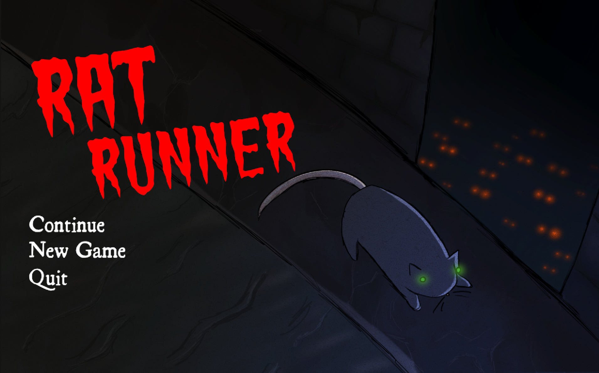
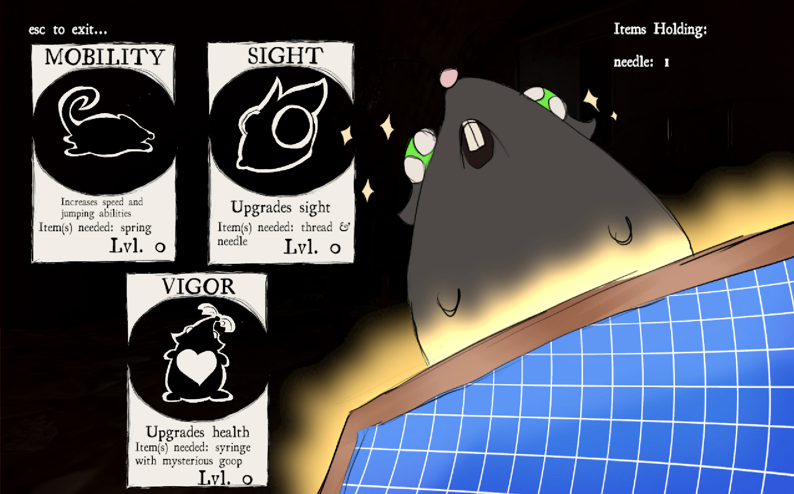

# Rat Runner

ᓚᘏᕐᐷ
ᓚᘏᕐᐷ

## Overview

Rat Runner is a 3D game created in Unity. You play as a rat who's trying to escape a maze created by the mad scientist who trapped him there. There are other rats who succumbed to the scientist's experiments running around the maze, chasing the player whenever they get too close. The player must find the key to escape the maze, and can also find items to give themself upgrades throughout the game. The player has 3 days to escape.

## Gameplay

Use WASD to move, C to change cameras. The player can touch items with the rat to collect them, and can use E to interact with the workbench to upgrade. Avoid the enemy rats, if the player's health goes down to 0, the day will progress. 

## My Role

I was the UX/UI and Audio Manager. 

For the UX/UI, I hand drew the menus on Procreate, and then handled the systems in game. I used C# to create slight animations in the game such as movement, the transition between one day to the next, and the vignettes that appear when an enemy is nearby and when the player is on their last life. I handled the switch between each game state, such as game over, menu, game, and pause state. 

For the audio, I implemented all the sounds my teammate created. I also created two of the audios, the atmosphere that plays throughout the game, and the audio that plays when an enemy is chasing the player. I used an AudioManager to keep track of all the audios, instead of having them scattered throughout the objects.

⪩. .⪨

