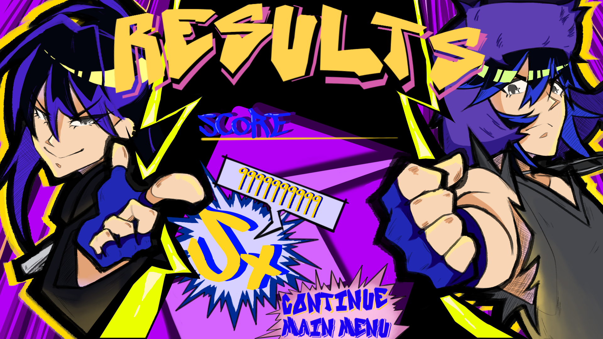
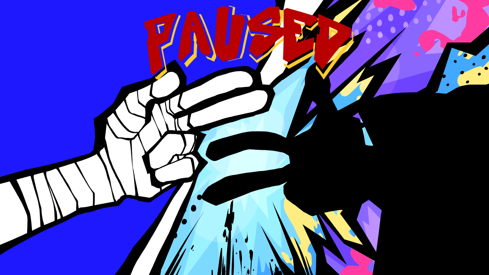
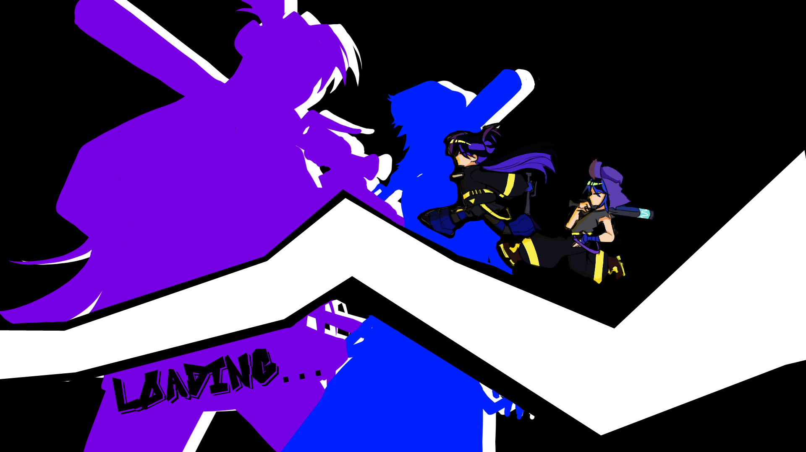
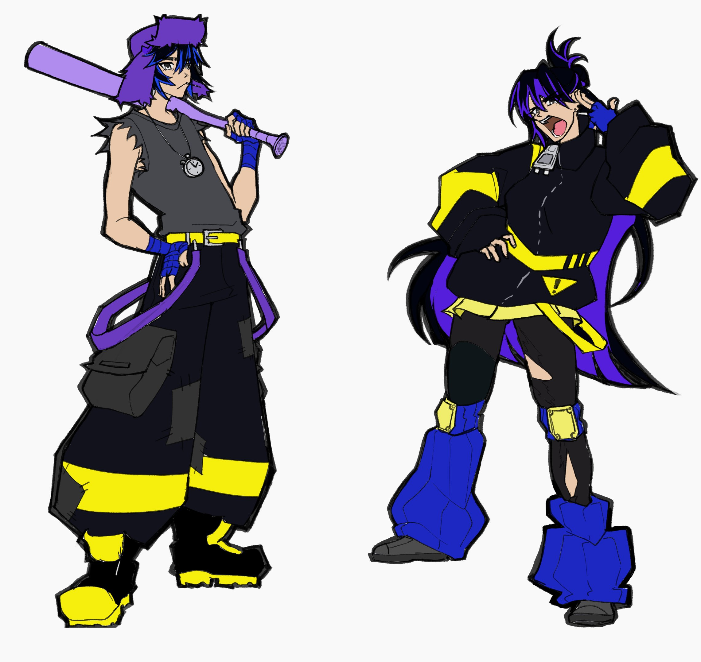

# Twinball

This game was funded by the Magic Maker Prototype Program at RIT

ִ ࣪𖤐
ִ ࣪𖤐

## Overview

Tired of their lives in the wastes, the story follows the "pinball twins" as they search for treasure so they can live in luxury. They are given a map by some odd scientist and are determined to live comfortably for the rest of their lives. Unfortunately, it appears a lot of other people have the same idea...

## Gameplay

Dynamic Pinball Inspired Boss Rush. Use the obstacles in the level to your advantage to damage the boss. These include bumpers and a variety of balls, such as a ball that splits in two, a bounce ball, and a damage ball.

## My Role

I was the art lead in this project. Once I joined the team, I created concept art for the main characters, and a couple of side characters and bosses. After that, I've helped create assets for the diver level and helped flesh out the story and world building in more details.

During the summer of 2025, I worked on making the art style more unique and flashy. I wanted the visuals to really stand out and grow sharper. As the Art Lead, I made sure everything was consistent as well as eye catching. I started to add coloring to my focus, and would color the screens and character art to really make them pop. We were able to finish one level, a tutorial, and several other menus, as well as design a few more characters. Examples of rough concepts transformed into solid character sheets are shown below.

⛧°。 ⋆༺♱༻⋆。 °⛧

