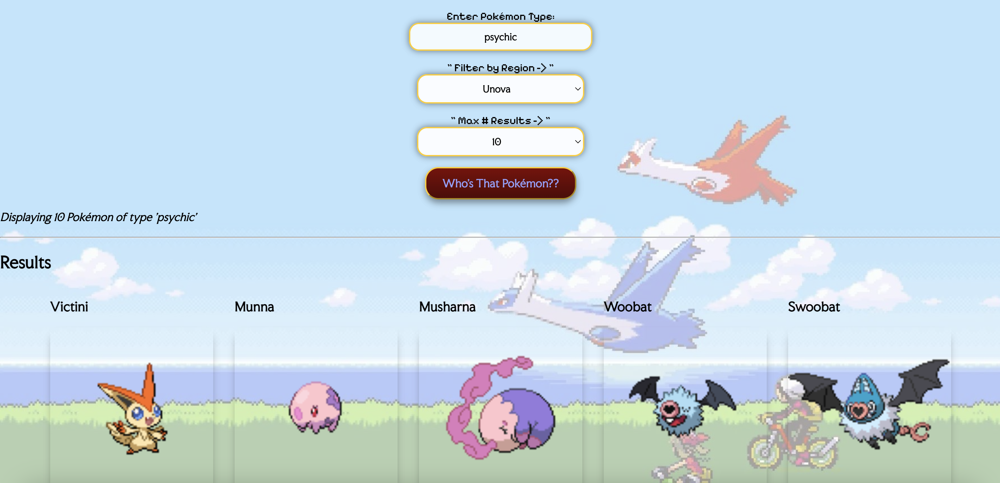
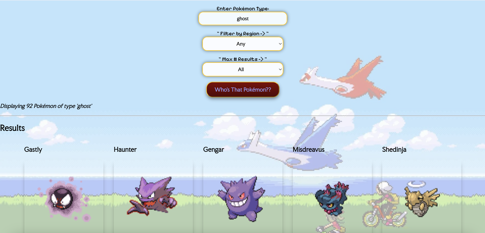

# Pokemon Finder

◓
◓

## Overview

A website that allows you to search for pokemon based on region, type, and the amount the user wishes to see. Utilizes data searching using the Pokemon API.

Example of filtering with every filter available.

## My Role

This was a solo project. This project taught me how to use Javascript to utilize API to gather data needed, as well as how to create a searching functionality on a website. I'm very proud of the overall design as I think it's cute and fits Pokemon's aesthetic, as well as how it fades in smoothly when the search button is pressed.

Example of only searching for a type

⋆˖⁺‧₊☽◯☾₊‧⁺˖⋆

