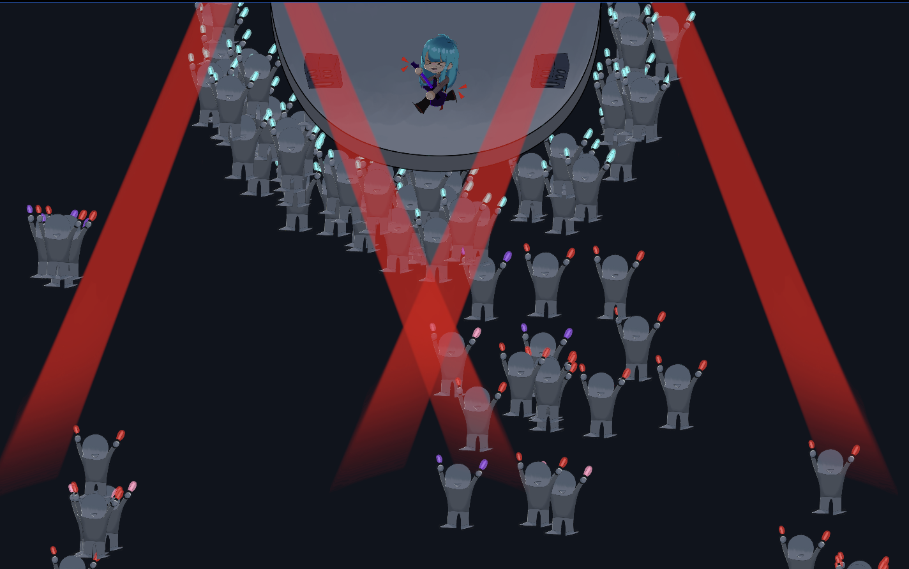
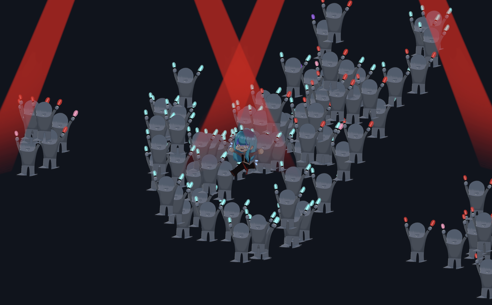

# Mina's Fans

♬ﾟ.
♬ﾟ.

## Overview

Mina is an idol who is very popular! Too popular... her fans get a little excited and start to chase her around. Simulates NPC behaviors such as flocking, arriving, and seeking. 

## Gameplay

Use WASD to move around the screen. Run around to see the fans chase you, as well as other idle fans that group together. Go on stage to see Mina's fans gather around the stage to watch her perform.

## My Role

This was a solo assignment. This assignment taught me a lot about steering behavior in NPCs, and how games make the environment more natural with it. Flocking was especially difficult, because of the 3 behaviors it comes with. I was able to learn how to utilize C# to express this behavior in my program successfully.

𝄞:♫⋆｡♪₊˚♬ﾟ.

